| DEVI SILMA YUNIAR | 312010458 |
|-------------------|-----------|
| Pemrograman Web   |  Lab5Web  |

## 1). Membuat Javascript Sederhana
### Hasil
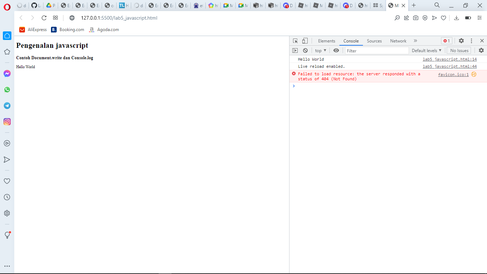

Membuat javascript sederhana dengan perintah document.write dan console.log

### Contoh Coding 
```html
<!DOCTYPE html>
<html lang="en">
<head>
    <meta charset="UTF-8">
    <meta http-equiv="X-UA-Compatible" content="IE=edge">
    <meta name="viewport" content="width=device-width, initial-scale=1.0">
    <title>MENGENAL JAVASCRIPT</title>
</head>
<body>
    <h1>Pengenalan javascript</h1>
    <h3>Contoh Document.write dan Console.log</h3>
    <script lang="javascript">
        document.write ("Hello World")
        console.log ("Hello World")
    </script>
</body>
</html>
```

## 2). Javascript Dasar
### Hasil
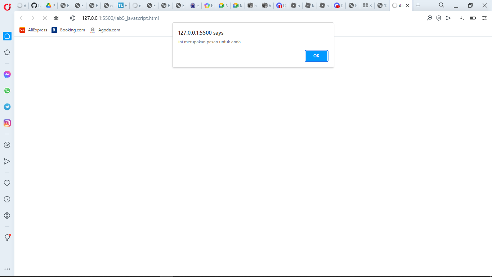
Properti alert untuk perintah pop

### Contoh Coding
```html
<!DOCTYPE html>
<html lang="en">
<head>
    <meta charset="UTF-8">
    <meta http-equiv="X-UA-Compatible" content="IE=edge">
    <meta name="viewport" content="width=device-width, initial-scale=1.0">
    <title>Alert Box</title>
</head>
<body>
    <script lang="javascript">
        window.alert("ini merupakan pesan untuk anda")
    </script>
</body>
</html>
```


### 3). Method Dalam Objek
### Hasil
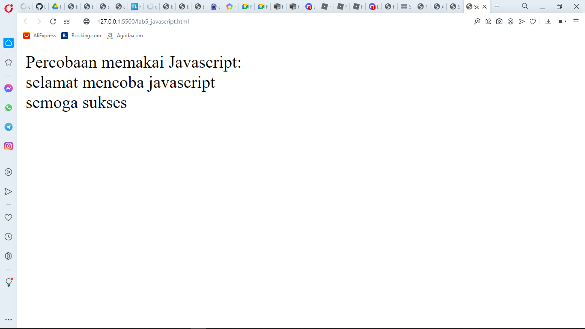

Menggunakan method dalam objek javascript

### Contoh Coding
```html
<!DOCTYPE html>
<html lang="en">
<head>
    <meta charset="UTF-8">
    <meta http-equiv="X-UA-Compatible" content="IE=edge">
    <meta name="viewport" content="width=device-width, initial-scale=1.0">
    <title>Script Javascript</title>
</head>
<body>
    Percobaan memakai Javascript:<br>
    <script lang="javascript">
        document.write("selamat mencoba javascript<br> ");
        document.write ("semoga sukses");
    </script>
</body>
</html>
```

## 4). Mamakai  Properti Prompt
### Hasil
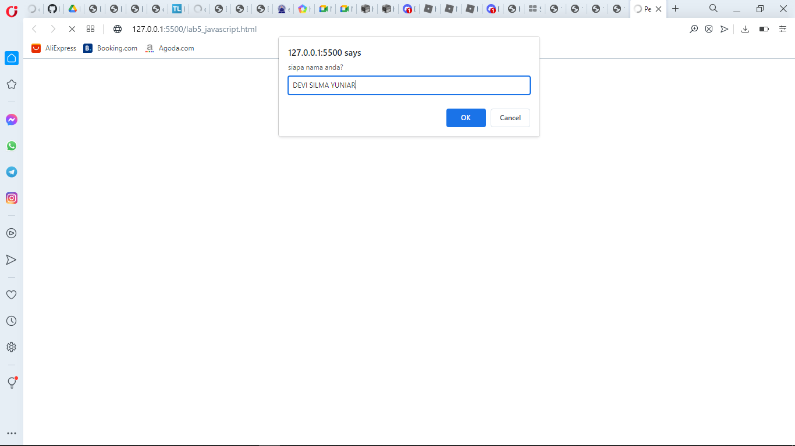

pemakaian properti prompt window pada script

### Contoh Coding
```html
<!DOCTYPE html>
<html lang="en">
<head>
    <meta charset="UTF-8">
    <meta http-equiv="X-UA-Compatible" content="IE=edge">
    <meta name="viewport" content="width=device-width, initial-scale=1.0">
    <title>Pemasukan Data</title>
</head>
<body>
    <script lang="javascript">
        var nama = prompt ("siapa nama anda?", "masukkan nama anda!");
        document.write("hai, " + nama);
    </script>
</body>
</html>
```

## 5). Pembuatan Function Dan Cara Pemanggilannya
### Hasil

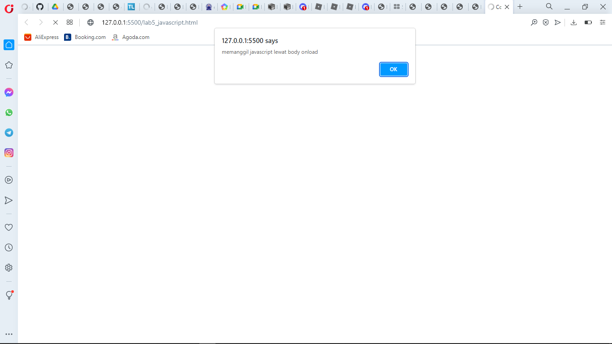

menggunakan function dengan body onload di javascript seperti gambar diatas 

### Contoh Coding
```html
<!DOCTYPE html>
<html lang="en">
<head>
    <meta charset="UTF-8">
    <meta http-equiv="X-UA-Compatible" content="IE=edge">
    <meta name="viewport" content="width=device-width, initial-scale=1.0">
    <title>Contoh program javascript</title>
    <script lang="javascript">
        function pesan(){
            alert ("memanggil javascript lewat body onload")
        }
    </script>
</head>
<body onload=pesan()>
    
</body>
</html>
```

## 6). Operasi Dasar Aritmatika
### Hasil
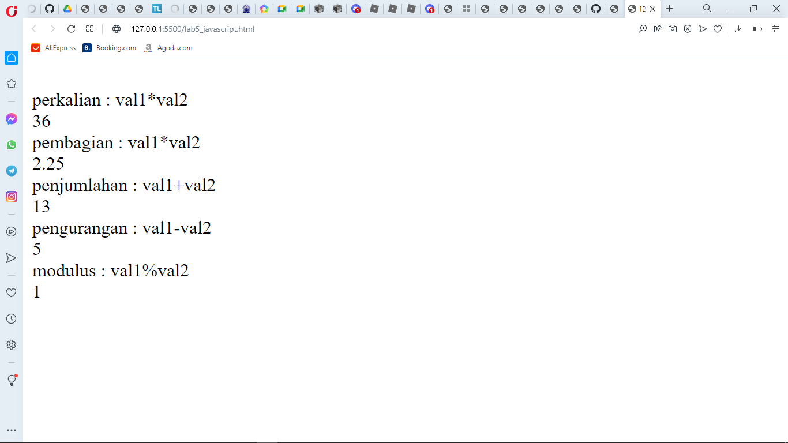

Operasi Dasar Aritmatika dalam **javascript** seperti contoh gambar diatas.

### Contoh Coding 
```html
<!DOCTYPE html>
<html lang="en">
<head>
    <meta charset="UTF-8">
    <meta http-equiv="X-UA-Compatible" content="IE=edge">
    <meta name="viewport" content="width=device-width, initial-scale=1.0">
    <title>Contoh program javascript</title>
    <script lang="javascript">
        function test (val1,val2)
        {
            document.write("<br>"+"perkalian : val1*val2 "+"<br>")
            document.write(val1*val2)
            document.write ("<br>"+"pembagian : val1*val2 "+"<br>")
            document.write(val1/val2)
            document.write("<br>"+"penjumlahan : val1+val2 "+"<br>")
            document.write(val1+val2)
            document.write("<br>"+"pengurangan : val1-val2 "+"<br>")
            document.write(val1-val2)
            document.write("<br>"+"modulus : val1%val2 "+"<br>")
            document.write(val1%val2)
        }
    </script>
</head>
<body>
    <input type="button" name="button1" value="aritmetic" onclick=test(9,4)>
</body>
</html>
```


## 7). Seleksi Kondisi (IF/ELSE)  
### Hasil
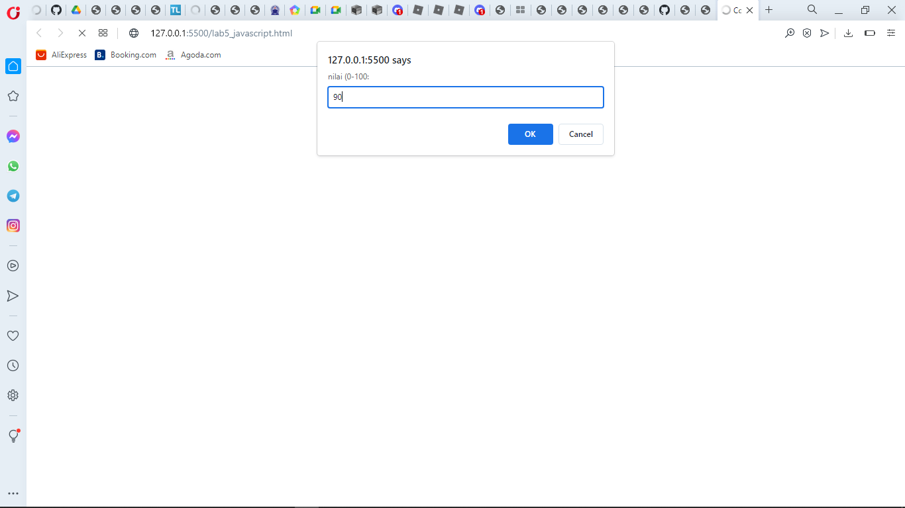
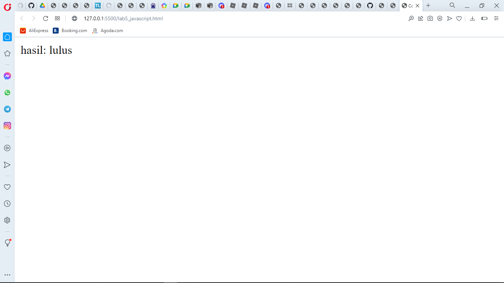

Disini adalah program seleksi kondisi dari if else disitu if nya jika nilai lebih sama dengan 60 berarti lulus dengan else nya jika dibawah 60 berarti tidak lulus, sementara saya memberi nilai 80 yang berarti hasilnya adalah lulus.

### Contoh Coding
```html
<!DOCTYPE html>
<html lang="en">
<head>
    <meta charset="UTF-8">
    <meta http-equiv="X-UA-Compatible" content="IE=edge">
    <meta name="viewport" content="width=device-width, initial-scale=1.0">
    <title>Contoh if-else</if-else></title>
</head>
<body>
    <script lang="javascript">
        var nilai = prompt("nilai (0-100: " , 0)
        var hasil = "";
        if (nilai >=60)
        hasil = "lulus";
        else
        hasil = "tidak lulus";
        document.write("hasil: "+hasil);
    </script>
</body>
</html>
```
## 8). Penggunaan Operator Switch Untuk Seleksi Kondisi
### Hasil
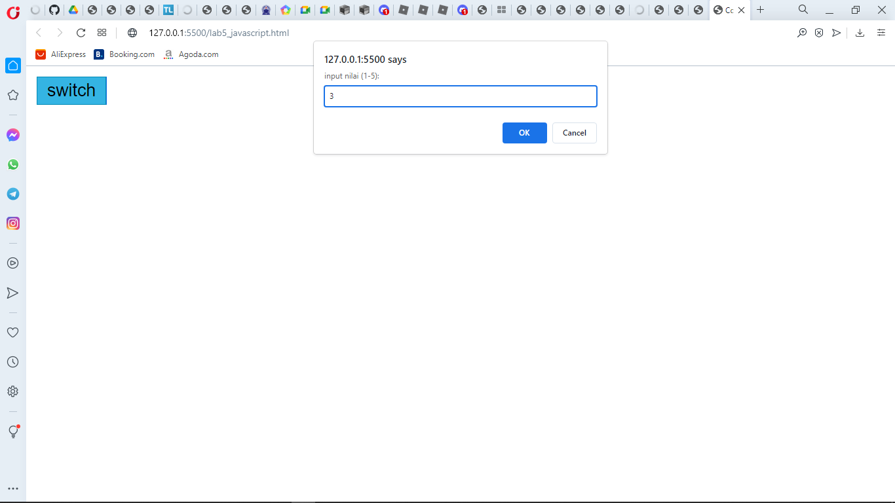

pilihan nya adalah 3 untuk pemilihan swicth nya maka tampilan dibrowser nya adalah ***bilangan tiga***

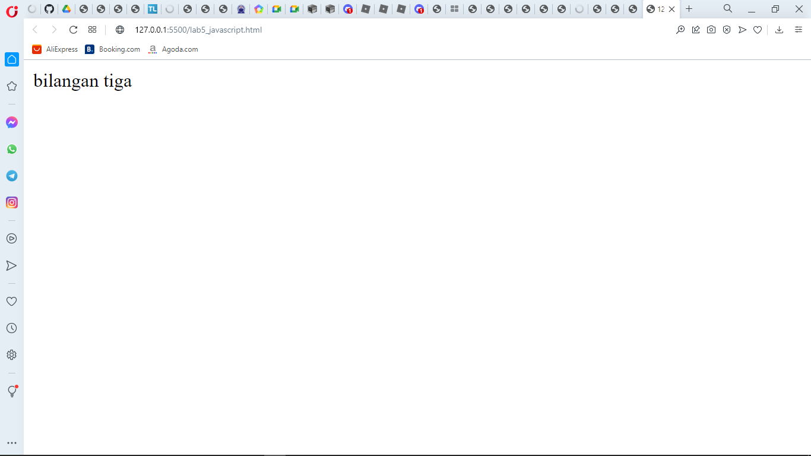

seperti contoh hasil nya di atas.

```html 
<!DOCTYPE html>
<html lang="en">

<head>
    <meta charset="UTF-8">
    <meta http-equiv="X-UA-Compatible" content="IE=edge">
    <meta name="viewport" content="width=device-width, initial-scale=1.0">
    <title>Contoh Program Javascript</title>
    <script lang="javascript">
        function test() {
            val1 = window.prompt("input nilai (1-5):")
            switch (val1) {
                case "1":
                    document.write("bilangan satu")
                    break
                case "2":
                    document.write("bilangan dua")
                    break
                case "3":
                    document.write("bilangan tiga")
                    break
                case "4":
                    document.write("bilangan empat")
                    break
                case "5":
                    document.write("bilangan lima")
                    break
                default:
                    document.write("bilangan lainnya")
            }
        }
    </script>
</head>

<body>
    <input type="button" name="button1" value="switch" onclick=test()>
</body>

</html>
```

## 9). Form Input

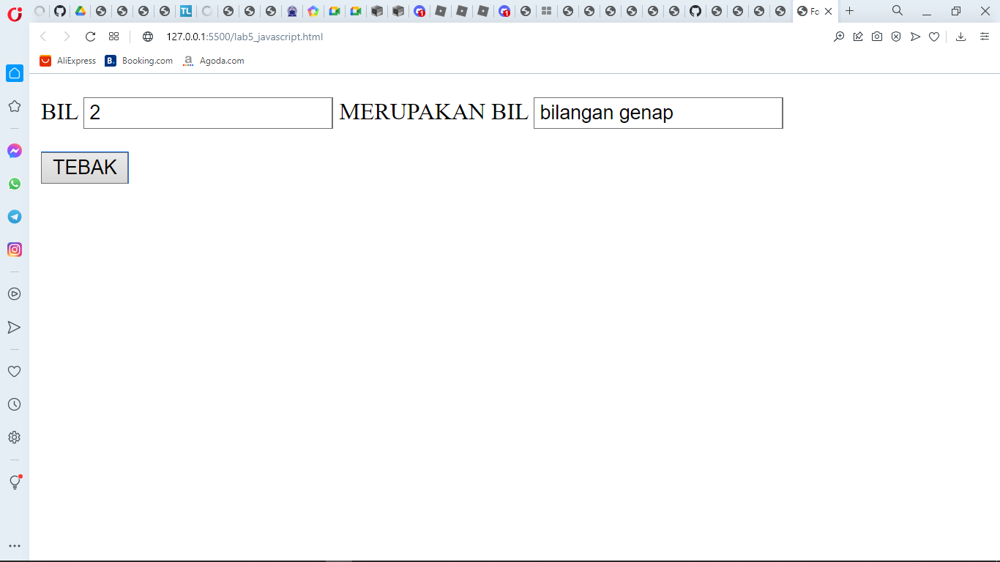

Contoh membuat form input dengan javascript dan html

```html
<!DOCTYPE html>
<html lang="en">
<head>
    <meta charset="UTF-8">
    <meta http-equiv="X-UA-Compatible" content="IE=edge">
    <meta name="viewport" content="width=device-width, initial-scale=1.0">
    <title>Form input</title>
    <script lang="javascript">
        function test () {
            var val1=document.kirim.T1.value
            if (val1%2==0)
                document.kirim.T2.value="bilangan genap"
            else
                document.kirim.T2.value="bilangan ganjil"
        }
    </script>
</head>
<body>
    <form action="" method="post" name="kirim">
        <p>BIL <input type="text" name="T1" id="T1" size="20"> MERUPAKAN BIL <input type="text" name="T2" id="T2" size="20"></p>
        <p><input type="button" value="TEBAK" name="B1" onclick=test()></p>
    </form>
</body>
</html>
```

## 10). Form Button
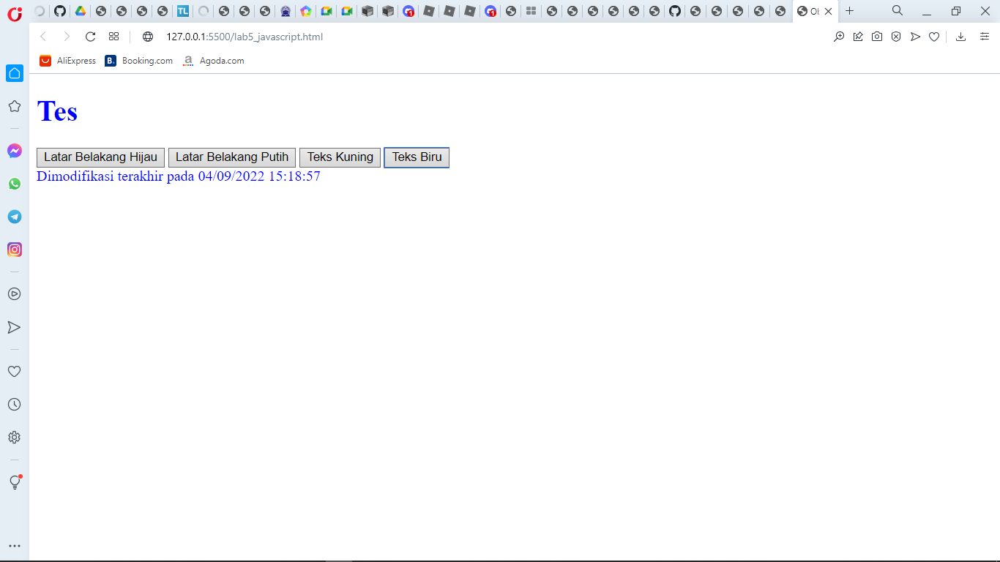

membuat form button dengan javascript dan function di script

```html
<!DOCTYPE html>
<html lang="en">
<head>
    <meta charset="UTF-8">
    <meta http-equiv="X-UA-Compatible" content="IE=edge">
    <meta name="viewport" content="width=device-width, initial-scale=1.0">
    <title>Objek Document</title>
</head>
<body>
    <script lang="javascript">
        function ubahWarnaLB(warna) {
            document.bgColor = warna;
        }
        function ubahWarnaLD(warna) {
            document.fgColor = warna;
        }
    </script>
    <h1>Tes</h1>
    <form action="">
        <input type="button" value="Latar Belakang Hijau" onclick="ubahWarnaLB('GREEN')">
        <input type="button" value="Latar Belakang Putih" onclick="ubahWarnaLB('WHITE')">
        <input type="button" value="Teks Kuning" onclick="ubahWarnaLD('YELLOW')">
        <input type="button" value="Teks Biru" onclick="ubahWarnaLD('BLUE')">
    </form>
    <script lang="javascript">
        document.write("Dimodifikasi terakhir pada " + document.lastModified);
    </script>
</body>
</html>
```

## 11). HTML DOM
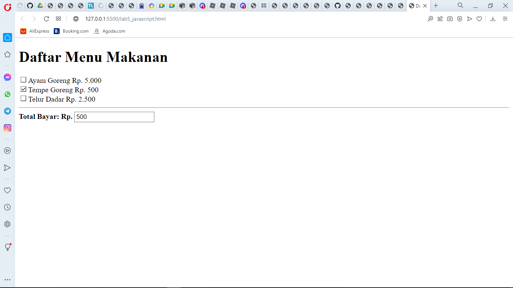

Membuat HTML DOM dengan javascript dan script di dalam html danjuga checkbox

```html
<!DOCTYPE html>
<!-- file daftar menu.html -->
<html lang="en">
<head>
    <meta charset="UTF-8">
    <meta http-equiv="X-UA-Compatible" content="IE=edge">
    <meta name="viewport" content="width=device-width, initial-scale=1.0">
    <title>Daftar Menu</title>
    <script lang="javascript">
        function hitung(ele) {
            var total = document.getElementById('total').value;
                total = (total ? parseInt(total) : 0);
            var harga = 0;

            if (ele.checked) {
                harga = ele.value;
                total += parseInt(harga);
            } else {
                harga = ele.value;
                if (total > 0)
                    total -= parseInt(harga);
            }
            document.getElementById('total').value = total;
        }
    </script>
</head>
<body>
    <h1>Daftar Menu Makanan</h1>
    <label><input type="checkbox" value="5000" name="menu1" id="menu1" onclick="hitung(this);">Ayam Goreng Rp. 5.000</label><br>
    <label><input type="checkbox" value="500" name="menu2" id="menu2" onclick="hitung(this);">Tempe Goreng Rp. 500</label><br>
    <label><input type="checkbox" value="2500" name="menu3" id="menu3" onclick="hitung(this);">Telur Dadar Rp. 2.500</label><hr>
    <strong>Total Bayar: Rp. <input type="text" name="total" id="total"></strong>
</body>
</html>
```

## 1) Pertanyaa dan  tugas buat validasi from

.png)

harus mengisi semua data baru terkirim jika tidak tidak akan terpanggil

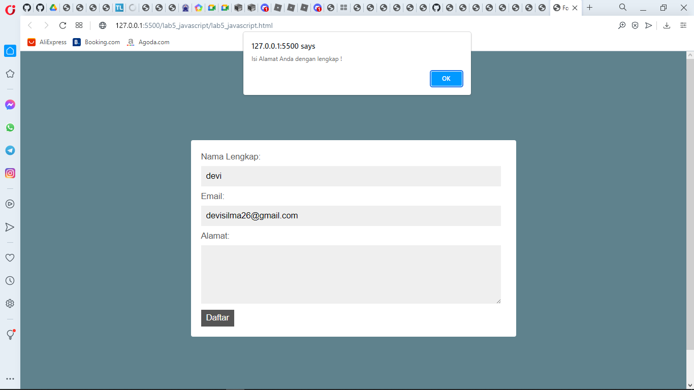

seperti contoh gambar di atas


```html
<!DOCTYPE html>
<html lang="en">
<head>
    <title>Form Validasi</title>
    <link rel="stylesheet" type="text/css" href="style.css">
    <script type="text/javascript">
        function validasiForm() {
            var nama = document.getElementById("nama").value;
            var email = document.getElementById("email").value;
            var alamat = document.getElementById("alamat").value;
            if (nama != "" && email != "" && alamat != "") {
                return true;
            } else {
                alert('Isi Alamat Anda dengan lengkap !');
                return false;
            }
        }
    </script>
</head>
<body>
     <div class="login">
        <form action="#" method="POST" onSubmit="return validasiForm()">
            <div>
                <label>Nama Lengkap:</label>
                <input type="text" name="nama" id="nama" />
            </div>
            <div>
                <label>Email:</label>
                <input type="email" name="email" id="email" />
            </div>
            <div>
                <label>Alamat:</label>
                <textarea cols="40" rows="5" name="alamat" id="alamat"></textarea>
            </div>
            <div>
                <input type="submit" value="Daftar" class="tombol">
            </div>
        </form>
    </div>
</body>
</html>
```

```css
body {
    background: #5f828d;
    font-family: sans-serif;
    padding: 100px;
  }
  

  .login {
    padding: 1em;
    margin: 2em auto;
    width: 30em;
    background: #fff;
    border-radius: 3px;
  }
  
  label {
    font-size: 10pt;
    color: #555;
  } 
  
  input[type="text"],
  input[type="email"],
  textarea {
    padding: 8px;
    width: 95%;
    background: #efefef;
    border: 0;
    font-size: 10pt;
    margin: 6px 0px; 
  }
   
  .tombol {
    background: #3498db;
    color: #fff;
    border: 0;
    padding: 5px 8px;
  } 
   .tombol:hover{
      background-color: #555;
  }
```
